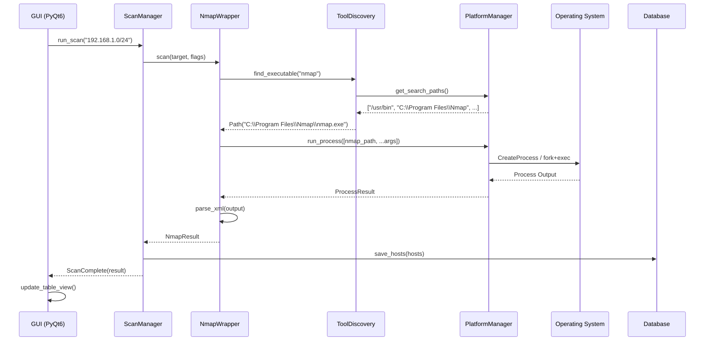

# Legion Cross-Platform Architecture

**Version**: 2.0 (Cross-Platform Redesign)  
**Datum**: 2025-11-11

---

## 🏗️ Architektur-Übersicht

Legion folgt einer **layered architecture** mit klarer Trennung zwischen Platform-spezifischem und -unabhängigem Code.

```
┌─────────────────────────────────────────────────────────┐
│                    User Interface                        │
│                      (PyQt6)                            │
└─────────────────┬───────────────────────────────────────┘
                  │
┌─────────────────▼───────────────────────────────────────┐
│                  Application Layer                       │
│         (Business Logic, Orchestration)                 │
│  ┌──────────┐  ┌───────────┐  ┌─────────────┐         │
│  │ Scanner  │  │ Project   │  │ Importer    │         │
│  │ Manager  │  │ Manager   │  │ Manager     │         │
│  └──────────┘  └───────────┘  └─────────────┘         │
└─────────────────┬───────────────────────────────────────┘
                  │
┌─────────────────▼───────────────────────────────────────┐
│                   Tool Layer                            │
│         (Abstraction for External Tools)                │
│  ┌──────────┐  ┌───────────┐  ┌─────────────┐         │
│  │  Nmap    │  │  Hydra    │  │   Nikto     │ ...     │
│  │ Wrapper  │  │ Wrapper   │  │  Wrapper    │         │
│  └──────────┘  └───────────┘  └─────────────┘         │
└─────────────────┬───────────────────────────────────────┘
                  │
┌─────────────────▼───────────────────────────────────────┐
│                Platform Layer                           │
│         (OS Abstraction & Detection)                    │
│  ┌──────────┐  ┌───────────┐  ┌─────────────┐         │
│  │   OS     │  │   Path    │  │  Privilege  │         │
│  │ Detector │  │  Manager  │  │   Manager   │         │
│  └──────────┘  └───────────┘  └─────────────┘         │
└─────────────────┬───────────────────────────────────────┘
                  │
┌─────────────────▼───────────────────────────────────────┐
│             Operating System / Hardware                  │
│        (Windows / Linux / macOS)                        │
└─────────────────────────────────────────────────────────┘
```

---

## 📦 Modul-Struktur

### 1. Platform Layer (`src/legion/platform/`)

**Verantwortung**: Abstraktion aller OS-spezifischen Funktionalität

#### `detector.py`
```python
"""OS und Platform Detection"""

class PlatformInfo:
    system: str          # 'Windows', 'Linux', 'Darwin'
    version: str         # OS Version
    is_wsl: bool        # Windows Subsystem for Linux
    architecture: str    # 'x64', 'arm64', etc.

def detect_platform() -> PlatformInfo:
    """Erkennt aktuelles OS und Eigenschaften"""
```

#### `paths.py`
```python
"""Platform-agnostische Pfad-Verwaltung"""

def get_data_dir() -> Path:
    """
    Returns:
        Windows: %LOCALAPPDATA%/legion
        Linux: ~/.local/share/legion
        macOS: ~/Library/Application Support/legion
    """

def get_config_dir() -> Path:
    """User-Konfiguration"""

def get_temp_dir() -> Path:
    """Temporäre Dateien"""

def get_log_dir() -> Path:
    """Log-Dateien"""
```

#### `privileges.py`
```python
"""Admin/Root Rechte-Verwaltung"""

def is_admin() -> bool:
    """Prüft Admin/Root-Rechte plattformunabhängig"""

def require_admin() -> None:
    """Fordert Admin-Rechte an oder wirft Exception"""

def elevate_if_needed() -> bool:
    """Versucht Elevation, returns success"""
```

#### `process.py`
```python
"""Prozess-Management Abstraktion"""

class ProcessWrapper:
    def run(self, command: list[str], **kwargs) -> ProcessResult:
        """Führt Prozess aus (KEIN shell=True!)"""
    
    async def run_async(self, command: list[str]) -> ProcessResult:
        """Async Prozess-Ausführung"""
    
    def kill(self, pid: int) -> None:
        """Beendet Prozess plattformunabhängig"""
```

---

### 2. Tool Layer (`src/legion/tools/`)

**Verantwortung**: Einheitliche Schnittstelle zu externen Tools

#### `base.py` - Basis-Klasse
```python
"""Basis für alle Tool-Wrapper"""

class ToolWrapper(ABC):
    name: str
    executable_name: str
    required: bool = True
    
    @abstractmethod
    def is_installed(self) -> bool:
        """Prüft ob Tool verfügbar ist"""
    
    @abstractmethod
    def get_version(self) -> str:
        """Ermittelt Tool-Version"""
    
    @abstractmethod
    async def run(self, *args, **kwargs) -> ToolResult:
        """Führt Tool aus"""
```

#### `discovery.py` - Tool-Discovery
```python
"""Automatisches Finden von Tools"""

class ToolDiscovery:
    def find_executable(self, name: str) -> Optional[Path]:
        """
        Sucht Tool in:
        1. PATH
        2. Common locations (OS-spezifisch)
        3. User-Config
        4. Registry (Windows)
        """
    
    def discover_all_tools(self) -> dict[str, Path]:
        """Findet alle bekannten Tools"""
```

#### `nmap/wrapper.py` - Nmap-Wrapper
```python
"""Nmap-Integration"""

class NmapWrapper(ToolWrapper):
    async def scan(
        self, 
        targets: str | list[str],
        flags: list[str],
        output_format: str = 'xml'
    ) -> NmapResult:
        """
        Führt Nmap-Scan durch
        
        Args:
            targets: IP, hostname, CIDR
            flags: ['-sV', '-sC', ...]
            output_format: 'xml', 'normal', 'grepable'
        
        Returns:
            NmapResult mit Hosts, Ports, Services
        """
    
    def parse_xml(self, xml_file: Path) -> NmapResult:
        """Parst Nmap XML Output"""
```

---

### 3. Core Layer (`src/legion/core/`)

**Verantwortung**: Business-Logik, OS-unabhängig

#### `scanner.py`
```python
"""Scan-Orchestrierung"""

class ScanManager:
    def __init__(self, nmap: NmapWrapper, db: Database):
        self.nmap = nmap
        self.db = db
    
    async def run_discovery_scan(
        self, 
        targets: list[str]
    ) -> ScanResult:
        """Führt Discovery-Scan durch"""
    
    async def run_service_scan(
        self,
        hosts: list[Host]
    ) -> ScanResult:
        """Service-Detection auf bekannten Hosts"""
    
    async def schedule_automated_scans(
        self,
        trigger: ScanTrigger
    ) -> None:
        """Automatische Follow-up-Scans"""
```

#### `models/host.py`
```python
"""Host Data Model"""

@dataclass
class Host:
    id: str
    ip: str
    hostname: Optional[str]
    os: Optional[OSInfo]
    status: HostStatus
    ports: list[Port]
    checked: bool = False
    
    def to_dict(self) -> dict:
        """Serialisierung"""
    
    @classmethod
    def from_dict(cls, data: dict) -> 'Host':
        """Deserialisierung"""
```

#### `project.py`
```python
"""Projekt-Management"""

class Project:
    name: str
    path: Path
    database: Database
    created_at: datetime
    
    async def save(self) -> None:
        """Speichert Projekt-State"""
    
    @classmethod
    async def load(cls, path: Path) -> 'Project':
        """Lädt Projekt"""
    
    async def export_report(
        self, 
        format: str = 'html'
    ) -> Path:
        """Exportiert Report"""
```

---

### 4. Configuration Layer (`src/legion/config/`)

**Verantwortung**: Konfiguration & Settings

#### `manager.py`
```python
"""Configuration Management"""

class ConfigManager:
    def load_config(self) -> Config:
        """
        Lädt Config aus:
        1. User-Config (höchste Priorität)
        2. System-Config
        3. Defaults
        """
    
    def save_config(self, config: Config) -> None:
        """Speichert User-Config"""
    
    def get_tool_path(self, tool_name: str) -> Optional[Path]:
        """Holt konfigurierten Tool-Pfad"""
    
    def set_tool_path(self, tool_name: str, path: Path) -> None:
        """Setzt Tool-Pfad"""
```

#### Config-Format (TOML)
```toml
[tools]
nmap = "/usr/bin/nmap"
hydra = "auto"  # Auto-discovery

[scanning]
max_parallel_scans = 5
timeout = 300

[ui]
theme = "dark"
font_size = 10

[wordlists]
usernames = ["~/.local/share/legion/wordlists/users.txt"]
passwords = ["~/.local/share/legion/wordlists/passwords.txt"]
```

---

## 🔄 Datenfluss-Beispiel: Nmap-Scan



---

## 🧩 Design Patterns

### 1. Strategy Pattern - Tool-Wrapper
Verschiedene Tool-Implementierungen austauschbar:
```python
class ScannerStrategy(Protocol):
    async def scan(self, target: str) -> ScanResult: ...

class NmapScanner(ScannerStrategy): ...
class MasscanScanner(ScannerStrategy): ...

# Usage
scanner: ScannerStrategy = NmapScanner()
result = await scanner.scan("192.168.1.1")
```

### 2. Factory Pattern - Tool-Discovery
```python
class ToolFactory:
    @staticmethod
    def create_tool(name: str) -> ToolWrapper:
        if name == "nmap":
            return NmapWrapper()
        elif name == "hydra":
            return HydraWrapper()
        # ...
```

### 3. Observer Pattern - Scan-Updates
```python
class ScanObserver(Protocol):
    def on_scan_progress(self, progress: float): ...
    def on_scan_complete(self, result: ScanResult): ...

class UIObserver(ScanObserver):
    def on_scan_progress(self, progress: float):
        self.progress_bar.setValue(int(progress * 100))
```

### 4. Repository Pattern - Database
```python
class HostRepository:
    async def get_by_id(self, id: str) -> Optional[Host]: ...
    async def get_all(self) -> list[Host]: ...
    async def save(self, host: Host) -> None: ...
    async def delete(self, id: str) -> None: ...
```

---

## 🔒 Security Considerations

### Subprocess Execution
- ❌ **NIE** `shell=True` verwenden
- ✅ Immer Argument-Listen: `["nmap", "-sV", ip]`
- ✅ Input-Validation vor Command-Execution
- ✅ Whitelisting von erlaubten Tools

### Path Traversal
```python
# Schutz gegen Path Traversal
def validate_output_path(user_path: str) -> Path:
    base = get_data_dir()
    resolved = (base / user_path).resolve()
    if not resolved.is_relative_to(base):
        raise SecurityError("Path traversal detected")
    return resolved
```

### Configuration Injection
```python
# Config-Validation mit Pydantic
class Config(BaseModel):
    nmap_path: FilePath  # Muss existierende Datei sein
    max_scans: int = Field(ge=1, le=100)  # 1-100
    timeout: int = Field(ge=10, le=3600)  # 10s-1h
```

---

## 📊 Performance-Optimierung

### Async/Await für I/O
```python
# Parallel Scanning
async def scan_multiple_hosts(hosts: list[str]):
    tasks = [nmap.scan(host) for host in hosts]
    results = await asyncio.gather(*tasks)
    return results
```

### Connection Pooling (DB)
```python
# SQLAlchemy Async Engine
engine = create_async_engine(
    "sqlite+aiosqlite:///legion.db",
    pool_size=10,
    max_overflow=20
)
```

### Lazy Loading
```python
# Hosts werden nur bei Bedarf geladen
@property
def ports(self) -> list[Port]:
    if self._ports is None:
        self._ports = self.db.get_ports(self.id)
    return self._ports
```

---

## 🧪 Testability

### Dependency Injection
```python
class ScanManager:
    def __init__(
        self,
        nmap: NmapWrapper,
        db: Database,
        config: Config
    ):
        # Alle Dependencies injiziert -> einfach zu mocken
        self.nmap = nmap
        self.db = db
        self.config = config
```

### Mocking External Tools
```python
@pytest.fixture
def mock_nmap():
    mock = Mock(spec=NmapWrapper)
    mock.scan.return_value = NmapResult(...)
    return mock

def test_scan_manager(mock_nmap):
    manager = ScanManager(nmap=mock_nmap, ...)
    result = await manager.run_scan("192.168.1.1")
    assert result.hosts_found > 0
```

---

## 📝 Error Handling

### Custom Exceptions
```python
class LegionError(Exception):
    """Basis für alle Legion Exceptions"""

class ToolNotFoundError(LegionError):
    """Tool nicht installiert oder nicht gefunden"""

class ScanFailedError(LegionError):
    """Scan-Ausführung fehlgeschlagen"""

class ConfigError(LegionError):
    """Konfigurationsfehler"""
```

### Graceful Degradation
```python
# Fallback wenn Tool nicht verfügbar
try:
    nmap = NmapWrapper()
except ToolNotFoundError:
    logger.warning("Nmap not found, using python-nmap")
    nmap = PythonNmapWrapper()  # Fallback-Implementation
```

---

## 🔄 Migration Path (Legacy → New)

### Adapter Pattern
```python
"""Ermöglicht graduelle Migration"""

class LegacyDatabaseAdapter:
    """Wrapper um alte DB für neue API"""
    
    def __init__(self, legacy_db):
        self.legacy_db = legacy_db
    
    async def get_hosts(self) -> list[Host]:
        # Convert legacy format to new models
        legacy_hosts = self.legacy_db.getHosts()
        return [self._convert_host(h) for h in legacy_hosts]
    
    def _convert_host(self, legacy_host) -> Host:
        return Host(
            id=legacy_host.id,
            ip=legacy_host.ip,
            # ... mapping
        )
```

---

## 📚 Weiterführende Dokumentation

- **API Dokumentation**: `docs/api/`
- **User Guide**: `docs/user_guide/`
- **Developer Guide**: `docs/developer_guide/`
- **Tool Integration**: `docs/tools/`

---

**Nächste Schritte**: Siehe [MIGRATION_PLAN.md](MIGRATION_PLAN.md)
